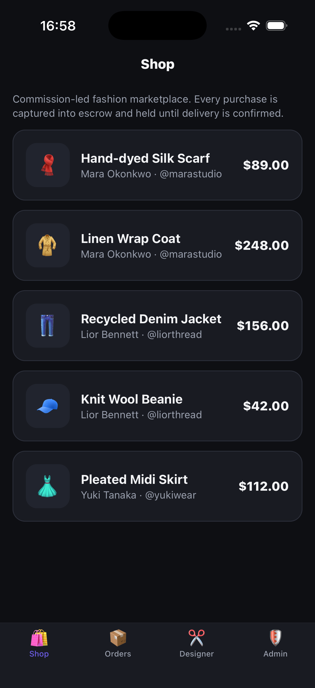
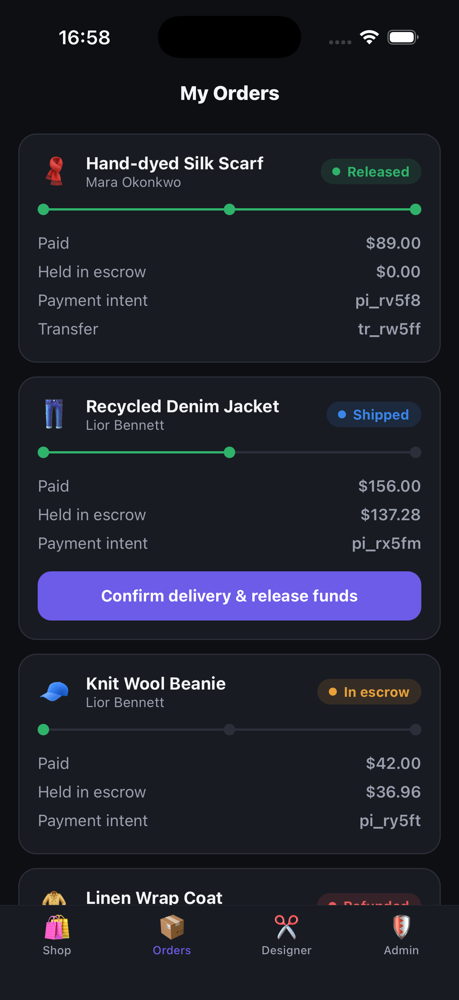
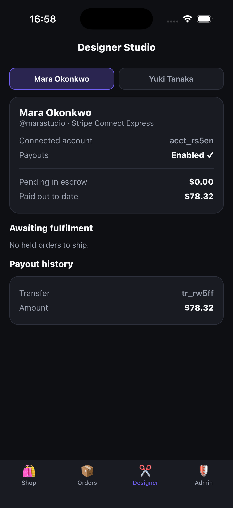
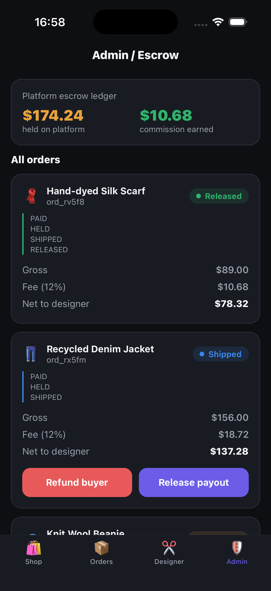

# Escrow Marketplace - Stripe Connect escrow for a two-sided fashion app

React Native (Expo) + TypeScript + Zustand front end with a Node/Express
"separate charges and transfers" escrow backend. Two separate experiences in one
app (consumer + designer) plus an admin/escrow surface. Runs end-to-end on a
simulator with **mock data and zero Stripe secrets** - the mock SDK mirrors the
real `stripe` Node SDK shape, so swapping in a live key needs no app changes.

## Screenshots

| Shop (consumer) | My Orders | Designer Studio | Admin / Escrow |
| --- | --- | --- | --- |
|  |  |  |  |

## Demo video

Backend-driven escrow lifecycle across all four surfaces:

https://github.com/phungnlg/expo-stripe-connect-escrow/raw/main/screenshots/demo.mp4


## What it shows

- **Two-sided marketplace**: consumer shopping + order tracking, a separate
  designer studio (Connect onboarding, pending escrow, payout history), and an
  admin escrow ledger - one codebase, role-scoped screens.
- **Stripe Connect escrow** (the hard requirement): money is captured to the
  **platform** balance and held, not sent straight to the seller. Funds release
  to the designer's connected account only on delivery confirmation, minus a 12%
  commission. Disputes refund the buyer with no transfer.
- **Order state machine**: `HELD -> SHIPPED -> RELEASED`, or `-> REFUNDED`.
- **Commission-led economics**: every release shows gross, 12% fee, and net to
  designer; the admin ledger totals held funds and commission earned.

## The escrow model

This is the part most "Stripe" builds get wrong. Destination charges
(`transfer_data` on the PaymentIntent) move money to the seller instantly - there
is no hold, so no escrow. This POC uses **separate charges and transfers**:

```
1. Buyer pays      paymentIntents.create({ amount })      // no transfer_data
                   -> funds land on the PLATFORM balance  // = escrow hold
2. Designer ships  order: HELD -> SHIPPED
3. Buyer confirms  transfers.create({ amount: net,        // = release
                     destination: acct, source_transaction: charge })
                   -> platform keeps the 12% fee
   (dispute)       refunds.create({ payment_intent })     // no transfer
```

`server/mockStripe.ts` documents the exact real Stripe call behind every mock.

## Backend <-> mobile workflow

```
  CONSUMER APP            DESIGNER STUDIO          ADMIN
  (app/index)            (app/designer)          (app/admin)
      |                       |                       |
      | POST /checkout        | POST /onboard         | POST /orders/:id/refund
      | POST /orders/:id/     | POST /orders/:id/ship | POST /orders/:id/release
      |   release             |                       |
      v                       v                       v
  +-----------------------------------------------------------+
  |              Express escrow backend (:4242)               |
  |   in-memory orders + designers + items                   |
  |   PLATFORM_FEE_BPS = 1200 (12%)                          |
  +-----------------------------------------------------------+
      |              |                |               |
      v              v                v               v
  paymentIntents  transfers        refunds      accountLinks   <- mockStripe.ts
  .create         .create          .create      .create        (real Stripe shape)
  (escrow hold)   (release-net)    (dispute)    (Express onboarding)
```

State flows one way: the app calls REST endpoints, the backend mutates the order
state machine and returns the serialized order, Zustand reloads, the UI re-renders.

## Stack

- **Mobile**: Expo SDK 54, expo-router (tabs), React Native 0.81 (New
  Architecture), TypeScript, Zustand, fetch.
- **Backend**: Node + Express, in-memory store, mock Stripe Connect SDK.

## Run

```bash
npm install
npm run server          # escrow backend on :4242
npx expo start --ios    # app on the iOS simulator
bash scripts/seed.sh    # optional: populate orders in every state
```

## Project layout

```
app/
  _layout.tsx     tab navigator (Shop / Orders / Designer / Admin)
  index.tsx       consumer: browse + pay into escrow
  orders.tsx      consumer: order tracker + confirm delivery
  designer.tsx    designer: Connect onboarding, escrow balance, ship, payouts
  admin.tsx       admin: escrow ledger, release / refund
src/
  lib/api.ts      fetch client + types
  lib/theme.ts    dark theme tokens
  lib/ui.tsx      Pill / Btn / Card / Row primitives
  store/escrow.ts Zustand store (checkout/ship/release/refund/onboard)
server/
  index.mjs       Express escrow API + order state machine
  mockStripe.mjs  mock Stripe Connect SDK (real-SDK shape, documented)
scripts/seed.sh   drive one order into each state for screenshots
```

Built by Phung Nguyen - github.com/phungnlg
